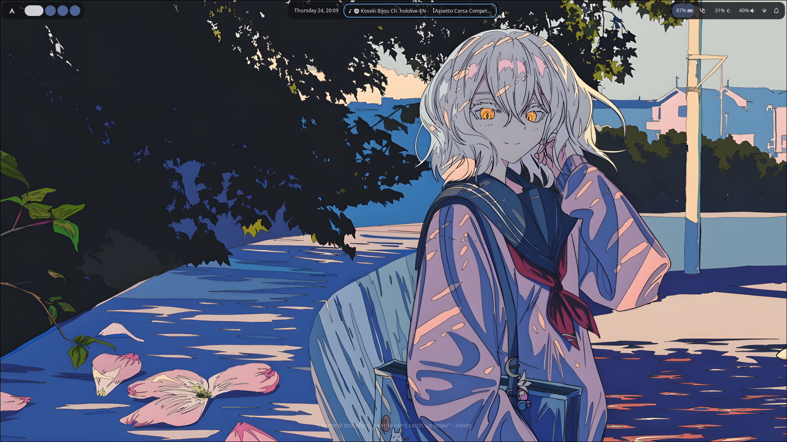

# Hyprland Dots
My customized Hyprland configuration that I use everyday!

<div align="center">
<div class="screenshot-container">
 
 
</div>
</div>
<br>

## Installation
You'll need to have installed all needed packages before installing my dotfiles! Use your package manager to do so. See needed packages on [My wiki](https://github.com/FairusKN/Hyprlands-dotfiles/wiki).

In order to install this style right away, just run this installation script:

> 💡 Tip: Note the `$` character means that it's recommended to run this command without root privileges.

```nushell
 $ git clone "https://github.com/FairusKN/Hyprlands-dotfiles.git"; cd Hyprlands-dotfiles; bash apply.sh
```

## Origin Dotfiles
https://github.com/retrozinndev/Hyprland-Dots.git

It's basically the same but i change it a little and because i want my configuration is on github lol.
